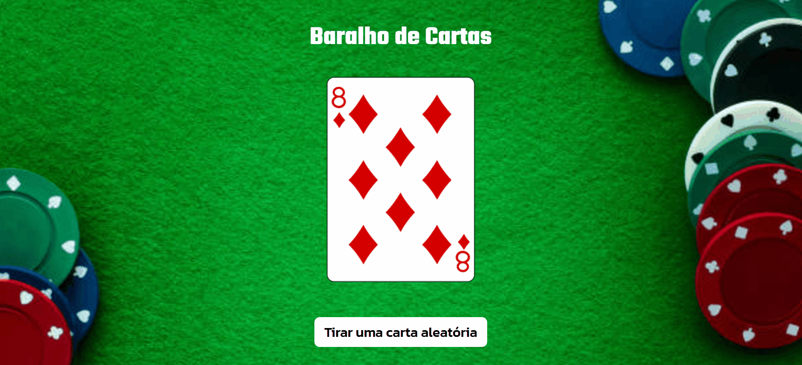

# Projeto Baralho de Cartas
Projeto de criação de um baralho de cartas que retira uma carta aleatória ao clicar no botão! ♣ ♥ ♠ ♦

## Linguagens utilizadas:
- HTML5
- CSS3
- JavaScript
- API Deck of Cards

## Objetivo:
Ao clicar no botão 'Tirar uma carta aleatória', uma carta diferente da atual aparecer na tela.

## Dificulades enfrentadas:
Na parte do HTML e CSS foi desenvolvido em poucos minutos pois não tinha muita coisa para fazer.
No JavaScript foi mais um teste de utilização de API no código JS, no código JS foi mais fácil pois eu já tinha conhecimento como buscar e utilizar os elementos.